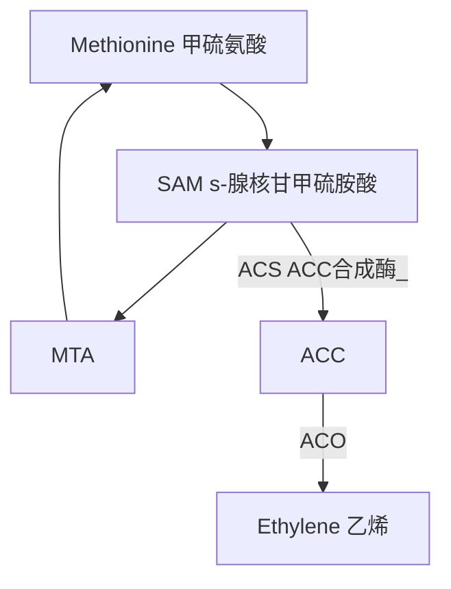

# 乙烯與果實後熟

乙烯是通過細胞中甲硫氨酸的分解形成的氣體。乙烯作為植物激素的效果取決於產生速率與逃逸速率。發芽的種子產生較多乙烯並逸出，**導致乙烯增多並逸並抑制葉面積增大**。新芽受光照之後，光敏素在植物細胞中產生信號。使**乙烯生成減少，促進葉面積增大**。當生長的枝條在地下遇到障礙時，乙烯產生大大增加，並**抑制細胞伸長並導致莖膨脹**，產生較粗的莖桿可以對阻礙其路徑的物體施加更大的壓力。**乙烯使莖有天然的負向地性**，向上生長。當樹木的莖受到風影響時，會產生側向壓力，使乙烯產生增多，進而使樹幹和枝條更粗、更堅固。

## 乙烯生合成與 Yang Cycle

## 後熟 (Ripening)

肉質果在成熟後期所進行的一系列特別的生理反應，是一個由植物荷爾蒙乙烯所調控的非常精準的生理變化，與果實品質有密切關係的反應

+ 果皮顏色
  
  + 沒有新色素產生：香蕉、番石榴、金冠蘋果(果皮呈黃綠色🍏，在靠近果梗周圍會有冠狀金黃鏽斑)
  
  + 有新色素產生：番茄、椪柑、愛文芒果

+ 果肉組織軟化

+ 儲藏性醣類組成改變

+ 揮發性成份生成

## 乙烯敏感度 (Ethylene sensitivity)

> 植物需要與多少濃度的乙烯接觸才會產生乙烯反應

## 門檻濃度 (threshold concentration)

> 果實對乙烯的敏感度都會隨著成熟逐漸提高，到達果實內部的乙烯濃度達到誘發該果實後熟所需要的濃度，此濃度稱「門檻濃度」

## 乙烯自動催化生成 (Autocatalytic ethylene production)

> 植物産生乙烯→**乙烯誘導ACS濃度提高**→ACS濃度提高(ACS為ACC合成酶)→ACC濃度提高→ACC 經過ACO作用變成乙烯→乙烯濃度提高

## 肉質果的乙烯生合成系統

### 系統 1

> 負責果實進入後熟之前的乙烯生成，所生成的乙烯量並不多，擔任**誘發進入後熟的角色**

### 系統 2

> 具有乙烯自動催化作用，乙烯的生成會**受到乙烯分子的回饋刺激而促進更多乙烯的生成**

## 影響園產品產乙烯產量的因子

+ 種類、品種、及年齡

+ 傷害

+ 溫度 (15度C\~25度C 速率高，溫度越低生成率越低，高溫可抑制乙烯生成，到35度C\~40度C許多園產品不能生成乙烯)

+ 二氧化碳 (一般來說，二氧化碳濃度越高，乙烯生成越少)

+ 氧氣

## 乙烯的感知 (Perception)

植物如何感知氣體乙烯並造成植物的乙烯反應？利用細胞膜上的胞器及細胞內的內質網

## 乙烯對園產品的作用

> + 刺激呼吸作用
> 
> + 催熟作用 (香蕉、蘋果、百香果)
> 
> + 催色作用 (檸檬、柑)
> 
> + 促進老化及增加貯藏障礙
> 
> + 促進果實離層 (方便機械採收)
> 
> + 引起甘藷、西瓜軟化
> 
> + 引起紅蘿蔔、甘藍之苦味及甘藷異味
> 
> + 促進馬鈴薯發芽
> 
> + 萵苣產生銹斑
> 
> + 康乃馨「瞌睡病」，使花朵不能正常開花
> 
> + 球根類發芽、長葉或不正長開花
> 
> + 冷藏中苗木、蔬菜、及水果產生生理障礙
> 
> + 葉片下垂

+ 發芽：抑制細胞擴大

+ 生長

+ 逆境：可以抗病

+ 根：根毛形成

+ 花：老化、脫落

+ 果實：後熟

> I. 在更年期給乙烯給予足量乙烯，可提早更年型呼吸峰之產生，乙烯對呼吸峰之高度影響不大。
> 
> II. 在更年期前給予不足量乙烯，可暫時刺激呼吸率上升，而移除乙烯後呼吸率又可恢復正常。
> 
> III. 已進入更年期呼吸率上升時給予乙烯影響甚微，除非此種產品乙烯本身很少，加了乙烯才比較有影響

## 乙烯在採後處理上之應用

### 乙烯生合成

+ 施用乙烯
  
  > 直接使用乙烯危險性較高
  
  + 使用益收(Ethrel)，在中性或鹼性中加入，會自動分解成乙烯
    
    > $C-CH_2-CH_2-{PO_3}^{2-}+H_2O → CH_2=CH_2 + Cl + {H_2PO_4}^{-}$
  
  + 使用乙烯發生器(Ethylene generator)，在那台機器裡面倒酒精，會噴出乙烯
    
    > $CH_3CH_2OH\xrightarrow[400\degree C+Al]{}C_2H_4+H_2O$

+ 去除乙烯
  
  + 臭氧
  
  + 紫外線 (可產生臭氧)
  
  + 溴化碳 (氧化還原，溴有毒)
  
  + 高錳酸鉀 $KMnO_4$ (氧化還原，最常用)

### 乙烯感知

+ 乙烯類形物 (乙炔 Ethylene analog)
  
  > 電石 + 水 → 乙炔 ( $C_2H_2; Acetylene)$ ，使用乙烯類形物濃度往往要比原本用乙烯還要高

+ 受器競爭物：硫代硫酸銀(silver thiosulfate, STS)、1-MCP (1-Methylcyclopropene; 1-甲基環丙烯)
  
  > 堵住受器使其無法反應

### 生物技術

RNA 干擾法，目前可利用 ACC synthase gene, ACC Oxidase gene。轉殖 RNA 產生雙股 RNA 植物細胞偵測到雙股後會將其消毀

轉殖 Antisense ACS 番茄無法正常後熟(無法自然進入系統2)，但仍可以催熟(受器還在)

Anti ACO 可延長開花(不會自己產生乙烯)

## 整理

| -   | ACS (ACC合成酶) | ACO | Ethylene        | Receptor    |
|:---:|:------------:|:---:|:---------------:|:-----------:|
| 促進  |              |     | 益收、乙烯發生器        |             |
| 抑制  |              |     | 臭氧、紫外線、溴化碳、高錳酸鉀 | 受器競爭物(硫代硫酸) |

