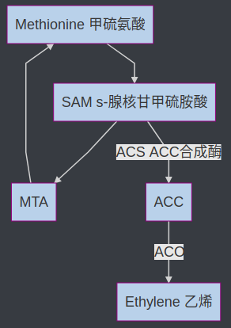

# 乙烯與果實後熟

乙烯是通過細胞中**甲硫氨酸(Methionine)的分解形成的氣體**。乙烯作為植物激素的效果取決於產生速率與逃逸速率。發芽的種子產生較多乙烯並逸出，**導致乙烯增多並逸並抑制葉面積增大**。新芽受光照之後，光敏素在植物細胞中產生信號。使**乙烯生成減少，促進葉面積增大**。當生長的枝條在地下遇到障礙時，乙烯產生大大增加，並**抑制細胞伸長並導致莖膨脹**，產生較粗的莖桿可以對阻礙其路徑的物體施加更大的壓力。**乙烯使莖有天然的負向地性**，向上生長。當樹木的莖受到風影響時，會產生側向壓力，使乙烯產生增多，進而使樹幹和枝條更粗、更堅固。

## 乙烯生合成與 Yang Cycle

## 後熟 (Ripening)

肉質果在成熟後期所進行的一系列特別的生理反應，是一個由植物荷爾蒙乙烯所調控的非常精準的生理變化，與果實品質有密切關係的反應

+ 果皮顏色
  
  + 沒有新色素產生：香蕉、番石榴、金冠蘋果(果皮呈黃綠色🍏，在靠近果梗周圍會有冠狀金黃鏽斑)
  
  + 有新色素產生：番茄、椪柑、愛文芒果

+ 果肉組織軟化

+ 儲藏性醣類組成改變

+ 揮發性成份生成

## 乙烯敏感度 (Ethylene sensitivity)

> 植物需要與多少濃度的乙烯接觸才會產生乙烯反應

## 門檻濃度 (threshold concentration)

> 果實對乙烯的敏感度都會隨著成熟逐漸提高，到達果實內部的乙烯濃度達到誘發該果實後熟所需要的濃度，此濃度稱「門檻濃度」

## 乙烯自動催化生成 (Autocatalytic ethylene production)

> 植物產生乙烯→**乙烯誘導ACS濃度提高**→ACS濃度提高(ACS為ACC合成酶)→ACC濃度提高→ACC 經過ACO作用變成乙烯→乙烯濃度提高

## 肉質果的乙烯生合成系統

### 系統 1

> 負責果實進入後熟之前的乙烯生成，所生成的乙烯量並不多，擔任**誘發進入後熟的角色**

### 系統 2

> 具有乙烯自動催化作用，乙烯的生成會**受到乙烯分子的回饋刺激而促進更多乙烯的生成**

## 影響園產品產乙烯產量的因子 / 影響乙烯效果的因子

+ 種類、品種：
  
  > 有些作物天生的對乙烯比較敏感，而有些則較不敏感。對乙烯敏感的作物之中亦有些變種變得對乙烯不敏感。例如番茄是對乙烯敏感的作物，有些突變種，如Rin變種番茄之果實，在正常空氣中不能被外加的乙烯催熟

+ 年齡
  
  > 園產品的年齡或成熟度不同，對乙烯的敏感度亦不同。許多年型果實，其成熟度越高，或越接近更年期，對乙烯越敏感，越容易催熟

+ 傷害
  
  > 園產品受到機械傷害、採摘，而造成傷害時可刺激乙烯之生產

+ 溫度
  
  > 低溫可減低乙烯的效力，但很難使乙烯完全無效
  > 
  > 大部分園產品在 15°C\~25°C 內生產乙烯速率最高，溫度越低生成率越低，高溫可抑制乙烯生成，到35°C\~40°C許多園產品不能生成乙烯

+ 氧
  
  > **低氧可抑制乙烯之作用**，使乙烯之效果減輕。但要完全解除乙烯之作用。需用非常低度的氧。例如「旭」品種蘋果在 0-3°C 及 1% 的氧氣氣調貯藏條件下對乙烯不敏感；但若有 1.5% 的氧氣時此種蘋果即對乙烯有敏感性
  > 
  > 氧氣濃度降低時，乙烯生成率亦降低。在**完全無氧狀態下植物體不能生成乙烯**。若**無氧狀態放置一段時間後再供給氧，則隨後可能出現暫時的大量乙烯生成**。

+ 二氧化碳 
  
  > 一般來說，**二氧化碳濃度越高，乙烯生成越少**。
  > 
  > 另一方面，二氧化碳是乙烯的競爭性抑制物(competitive inhibitor)。但乙烯與受其結合合置(biding site)之親和力遠大二氧化碳。因此，乙烯濃度很高時，二氧化碳的抑制效果不大

+ 其他化學物質
  
  > 因為乙烯常常對園產品產生破壞性作用，許多學者曾致力於尋找抑制乙烯作用之物質。目前已找到比較有效有**銀離子**及 **2,5-norbornadiene** 兩種
  > 
  > 前者如硫代硫酸銀可用於花卉，但不能用於水果或蔬菜等食品。後者因有惡臭對花卉也不能用，只能供研究上使用

## 乙烯的感知 (Perception)

植物如何感知氣體乙烯並造成植物的乙烯反應？利用細胞膜上的胞器及細胞內的內質網

## 乙烯對園產品的作用

> + 刺激呼吸作用
>   
>   > 乙烯能刺激提高絕大多數果實、花及貯藏器官的呼吸作用。但除了少數例外，對葉及幼苗之呼吸率並無明顯的刺激作用
>   > 
>   > ---
>   > 
>   > 對**非更年型果實**而言，**乙烯之濃度越高**，**所刺激提高的呼吸率亦越高**，直到飽和濃度到達為止。當乙烯移去後，呼吸率又逐漸恢復原狀
>   > 
>   > ---
>   > 
>   > 對更年型果實而言，則較為複雜
>   > 
>   > 1. 在更年期前給予**足量之乙烯**，可提早更年型呼吸峰之產生，乙烯對呼吸峰之高度影響不大。**一旦呼吸峰產生，移去乙烯不能再使呼吸率下降**
>   > 
>   > 2. 在更年期前給予**不足量乙烯**，可暫時刺激呼吸率上升，而**移除乙烯後，呼吸率又可恢復正常**。經此不足量乙烯刺激後之果實，可能縮短其更年期前壽命，亦即此果實可較未經乙烯刺激之果實提早更年型呼吸之產生
>   > 
>   > 3. 已進入更年期呼吸率上升時給予乙烯影響甚微，除非此種產品乙烯本身很少，加了乙烯才比較有影響(增高呼吸率)
> 
> + 催熟作用 (香蕉、蘋果、百香果)
> 
> + 催色作用 (檸檬、柑)
>   
>   > 乙烯可破壞葉綠素，使產品褪去綠色。在商業上將綠色的檸檬、寬皮柑、甜橙等置催色室中加乙烯處理，可轉綠為黃。乙烯亦可增加番茄的胡蘿蔔素與紅色花青素 (lycopene)，以及增加紫色葡萄花青素
> 
> + 促進老化(senescence)及增加貯藏障礙(storage disorders)
>   
>   > 1. 脫落現象(abscission)
>   >    
>   >    促進果實離層 (方便機械採收)，但亦時採後，尤其是貯藏中的蔬菜如甘藍、白菜、芹菜、花椰菜落葉，或水果如柑桔和果菜如番茄等落蒂，或切花和盆栽花卉之落花、落葉等均為不利之作用。
>   > 
>   > 2. 引影質地變化
>   >    
>   >    引起甘藷、西瓜軟化
>   > 
>   > 3. 變味
>   >    
>   >    引起紅蘿蔔、甘藍之苦味及甘藷異味
>   > 
>   > 4. 促進馬鈴薯發芽
>   > 
>   > 5. 萵苣產生銹斑
>   > 
>   > 6. 康乃馨「瞌睡病」，使花朵不能正常開花
>   > 
>   > 7. 球根類發芽、長葉或不正長開花
>   > 
>   > 8. 冷藏中苗木、蔬菜、及水果產生生理障礙
>   > 
>   > 9. 引起許多植物葉片下垂(epinasty)

+ 發芽：抑制細胞擴大

+ 生長

+ 逆境：可以抗病

+ 根：根毛形成

+ 花：老化、脫落

+ 果實：後熟

## 乙烯在採後處理上之應用

### 乙烯生合成

+ 施用乙烯
  
  > 直接使用乙烯危險性較高
  > 
  > 理論上 10 ppm 的濃度已足夠催熟作用。但在實用上一方面因為要補償催熟室隙縫的漏失，另一方面要克服因催熟室氧濃度之降低及二氧化碳濃度升高而造成減低乙烯效率，所以常用到 1000 ppm。
  > 
  > 另外，在催熟時要避免缺氧或聚集二氧化碳並控制溫度適中，溼度要高
  
  + 使用益收(Ethrel)，在中性或鹼性中加入，會自動分解成乙烯
    
    > $Cl-CH_2-CH_2-{PO_3}^{2-}+H_2O → CH_2=CH_2 + Cl + {H_2PO_4}^{-}$
  
  + 使用乙烯發生器(Ethylene generator)，在那台機器裡面倒酒精，會噴出乙烯
    
    > $CH_3CH_2OH\xrightarrow[400\degree C+Al]{}C_2H_4+H_2O$

+ 去除乙烯
  
  + 臭氧
  
  + 紫外線 (可產生臭氧)
  
  + 溴化碳 (氧化還原，溴有毒)
  
  + 過錳酸鉀 $KMnO_4$ (氧化還原，最常用)

### 乙烯感知

+ 乙烯類形物 (乙炔 Ethylene analog)
  
  > 電石 + 水 → 乙炔 ( $C_2H_2; Acetylene)$ ，使用乙烯類形物濃度往往要比原本用乙烯還要高

+ 受器競爭物：硫代硫酸銀(silver thiosulfate, STS)、1-MCP (1-Methylcyclopropene; 1-甲基環丙烯)
  
  > 堵住受器使其無法反應

### 生物技術

RNA 干擾法，目前可利用 ACC synthase gene, ACC Oxidase gene。轉殖 RNA 產生雙股 RNA 植物細胞偵測到雙股後會將其消毀

轉殖 Antisense ACS 番茄無法正常後熟(無法自然進入系統2)，但仍可以催熟(受器還在)

Anti ACO 可延長開花(不會自己產生乙烯)

## 整理

| -   | ACS (ACC合成酶)     | ACO        | Ethylene        | Receptor    |
|:---:|:----------------:|:----------:|:---------------:|:-----------:|
| 促進  |                  |            | 益收、乙烯發生器        |             |
| 抑制  | 轉殖 Antisense ACS | 轉殖Anti ACO | 臭氧、紫外線、溴化碳、過錳酸鉀 | 受器競爭物(硫代硫酸) |
